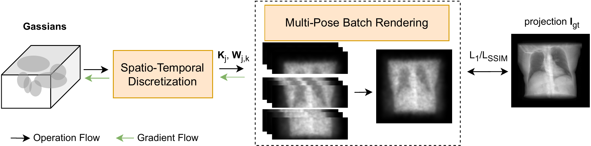
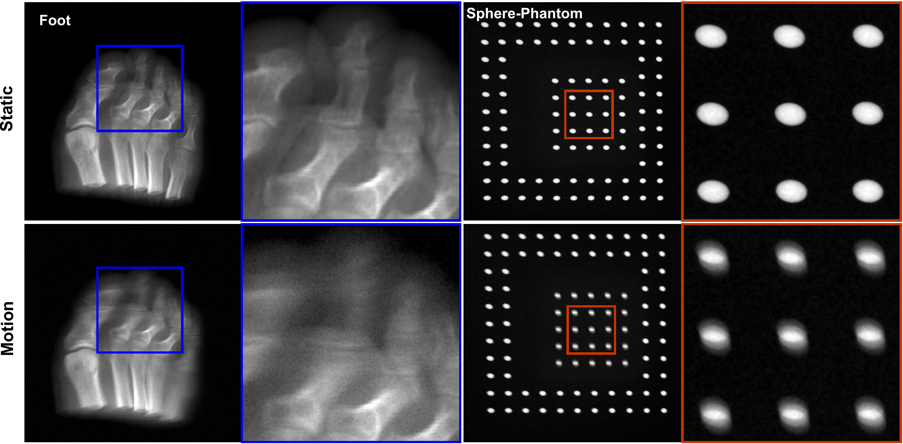
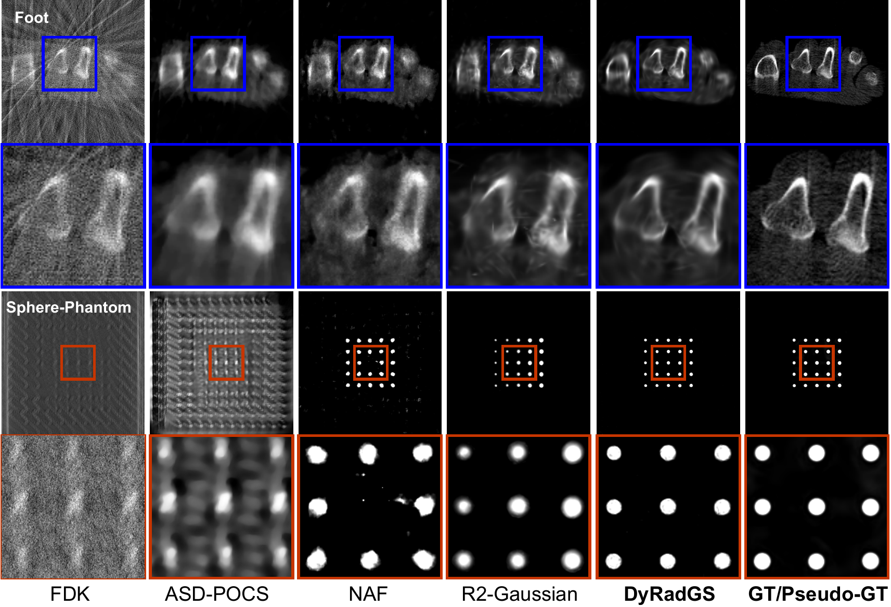

# PhyRadGS: Physics-Aware Radiative Gaussian Splatting for Fly-Scanning CBCT Reconstruction

**Anwei Li, Zhongyang Zheng, Tianyuan Sun, Yubing Zhang, Rongqiu Wang**

*MICCAI 2026*

[](LICENSE.md)

## Abstract

Cone-Beam CT (CBCT) systems utilizing continuous gantry rotation and flat-panel detector readout introduce complex acquisition dynamics, such as angular motion blur and rolling shutter distortion. Conventional reconstruction algorithms, however, typically rely on a static geometry assumption, inevitably leading to blurred structures and geometric inconsistencies. We propose **PhyRadGS**, a physics-aware 3DGS framework that integrates a novel spatial-temporal discretization strategy. Specifically, we explicitly model rolling shutter by spatially partitioning projections and motion blur by temporally segmenting the exposure duration. Furthermore, we implement a parallelized multi-pose batch rendering pipeline to mitigate computational overhead, maintaining the real-time efficiency inherent to 3DGS. Experiments on synthetic and real-world datasets demonstrate PhyRadGS significantly outperforms state-of-the-art static baselines, improving PSNR by **+2.3 dB** and SSIM by **+0.043**.

## Method



**PhyRadGS pipeline.** (a) **Spatio-Temporal Discretization** — continuous kinematics are discretized into M spatial strips (rolling shutter) and N temporal sub-intervals (motion blur). (b) **Multi-Pose Batch Rendering** — micro-views are rendered in parallel and assembled into the final projection.



Comparison of static and motion projections. Static simulation ignores the integration blur and rolling shutter distortion present in real fly-scanning acquisitions.

## Results

| Method | Syn 25-view PSNR↑ | SSIM↑ | Syn 50-view PSNR↑ | SSIM↑ | Real Phantom PSNR↑ | SSIM↑ | Time↓ |
|---|---|---|---|---|---|---|---|
| FDK | 18.01 | 0.090 | 20.72 | 0.152 | 30.04 | 0.794 | - |
| ASD-POCS | 27.99 | 0.777 | 30.94 | 0.834 | 30.29 | 0.844 | **0.4** |
| NAF | 28.18 | 0.776 | 30.96 | 0.844 | 27.52 | 0.779 | 163.6 |
| SAX-NeRF | 28.02 | 0.773 | 30.62 | 0.849 | - | - | - |
| R2-Gaussian (static) | 28.93 | 0.828 | 32.12 | 0.889 | 35.12 | 0.852 | 8.0 |
| PhyRadGS w/o ST | 29.00 | 0.834 | 31.96 | 0.891 | 35.13 | 0.855 | **3.1** |
| R2-Gaussian w/ ST | 31.22 | 0.866 | **33.97** | 0.909 | 36.84 | 0.861 | 19.4 |
| **PhyRadGS (Ours)** | **31.23** | **0.871** | 33.54 | **0.910** | **37.43** | **0.862** | 5.2 |

**Ablation study** on discretization parameters (M strips, N sub-intervals):

| M | PSNR↑ | SSIM↑ | Time↓ | | N | PSNR↑ | SSIM↑ | Time↓ |
|---|---|---|---|---|---|---|---|---|
| 1 | 29.79 | 0.851 | **3.98** | | 1 | 29.27 | 0.848 | **3.14** |
| 4 | 30.62 | 0.869 | 4.52 | | 3 | 31.16 | 0.870 | 3.98 |
| 8 | 31.22 | 0.871 | 5.16 | | 5 | **31.22** | 0.871 | 5.16 |
| 16 | **31.53** | **0.884** | 6.84 | | 7 | 31.21 | **0.873** | 6.18 |

Time measured in minutes on a single NVIDIA RTX 4090.



**Reconstruction slice comparison (25 fly-scanning views).** Top rows: synthetic "Foot". Bottom rows: real "Sphere Phantom". Static methods suffer severe blurring and distortion; PhyRadGS recovers sharp boundaries and fine structures.

## Installation

### Requirements

- Linux, CUDA 12.x, Python 3.11, PyTorch 2.10+

### 1. Environment

```bash
git clone https://github.com/liaw05/PhyRadGS.git --recursive
cd PhyRadGS
git submodule update --init --recursive

# micromamba (recommended) or conda
micromamba env create -f environment.yml
micromamba activate xray_gaussian
```

### 2. CUDA Extensions

```bash
export CUDA_HOME=$CONDA_PREFIX
pip install algorithms/submodules/simple-knn --no-build-isolation
pip install algorithms/r2_gaussian/xray-gaussian-rasterization-voxelization --no-build-isolation
pip install algorithms/r2_gaussian_mr/xray-gaussian-rasterization-voxelization-mr --no-build-isolation
pip install algorithms/gsplat_xray --no-build-isolation
```

### 3. TIGRE (optional — for data generation & traditional baselines)

```bash
wget https://github.com/CERN/TIGRE/archive/refs/tags/v2.3.zip
unzip v2.3.zip && pip install TIGRE-2.3/Python --no-build-isolation
```

## Dataset

Download from [Google Drive]().

### Synthetic Fly-Scanning Dataset

15 volumes across two scan protocols (25/50 views).

```
cone_ntrain_{25,50}_angle_360/{case}/
├── meta_data.json                                   # Static geometry config
├── meta_data_motion_blur_rolling_shutter_fps18.json # Motion geometry config
├── vol_gt.npy                                       # Ground truth volume
├── init_{case}.npy                                  # FDK initialization
├── proj_train/          # Static projections (*.npy)
├── proj_test/           # Static test projections (*.npy)
├── train_motion_blur_rolling_shutter_fps18/  # Fly-scanning projections (*.npy)
└── test_motion_blur_rolling_shutter_fps18/   # Fly-scanning test projections (*.npy)
```

### Real Phantom Dataset

Double-layer sphere phantom on a commercial CBCT system.

```
real_phantom_data/
├── pseudo_gt.npy                 # Reference volume (64 static views, R2-Gaussian)
└── motion_v32/                   # 32 fly-scanning projections
    ├── geometric_0205_motion_rs.json
    └── projections/              # {idx}.tif
```

### Generate Your Own

See `data_generator/synthetic_dataset/` and `data_generator/real_dataset/` for TIGRE-based data generation scripts.

## Quick Start

```bash
# 1. Initialize point cloud (FDK)
python initialize_pcd.py --data <path_to_case>

# 2. Train
# PhyRadGS (M=8, N=5, motion mode)
python scripts/run_experiment.py -s <path_to_case> -m output/exp \
    --config config/experiments/gsplat-xray_motion.yaml

# R2-Gaussian (static baseline)
python scripts/run_experiment.py -s <path_to_case> -m output/exp \
    --config config/experiments/r2_static.yaml

# R2-Gaussian w/ ST (motion mode)
python scripts/run_experiment.py -s <path_to_case> -m output/exp \
    --config config/experiments/r2mr_motion.yaml

# 3. Evaluate
python test.py -m <path_to_model>
python scripts/evaluate_metric.py -p pred_vol.nii.gz -g gt_vol.nii.gz

# 4. Traditional baselines (FDK, SART, ASD-POCS, CGLS)
python scripts/run_traditional_methods.py --data <path_to_case> -o output/traditional
```

## Key Configuration

| Key | Values | Description |
|---|---|---|
| `renderer` | `gsplat-xray`, `r2_gaussian`, `r2_gaussian_mr` | Algorithm backend |
| `recon_mode` | `static`, `motion_equivalent`, `motion` | Reconstruction mode |
| `num_exposure_frames` | int (e.g., 5) | Temporal sub-intervals N |
| `num_rolling_shutter_frames` | int (e.g., 8) | Spatial strips M |
| `iterations` | int | Total training iterations |

## Citation

```bibtex
@inproceedings{li2026phyradgs,
  title={PhyRadGS: Physics-Aware Radiative Gaussian Splatting for Fly-Scanning CBCT Reconstruction},
  author={Li, Anwei and Zheng, Zhongyang and Sun, Tianyuan and Zhang, Yubing and Wang, Rongqiu},
  booktitle={International Conference on Medical Image Computing and Computer-Assisted Intervention (MICCAI)},
  year={2026}
}
```

## Acknowledgments

This work builds upon [3D Gaussian Splatting](https://github.com/graphdeco-inria/gaussian-splatting), [gsplat](https://github.com/nerfstudio-project/gsplat), and [R2-Gaussian](https://github.com/Ruyi-Zha/r2_gaussian).